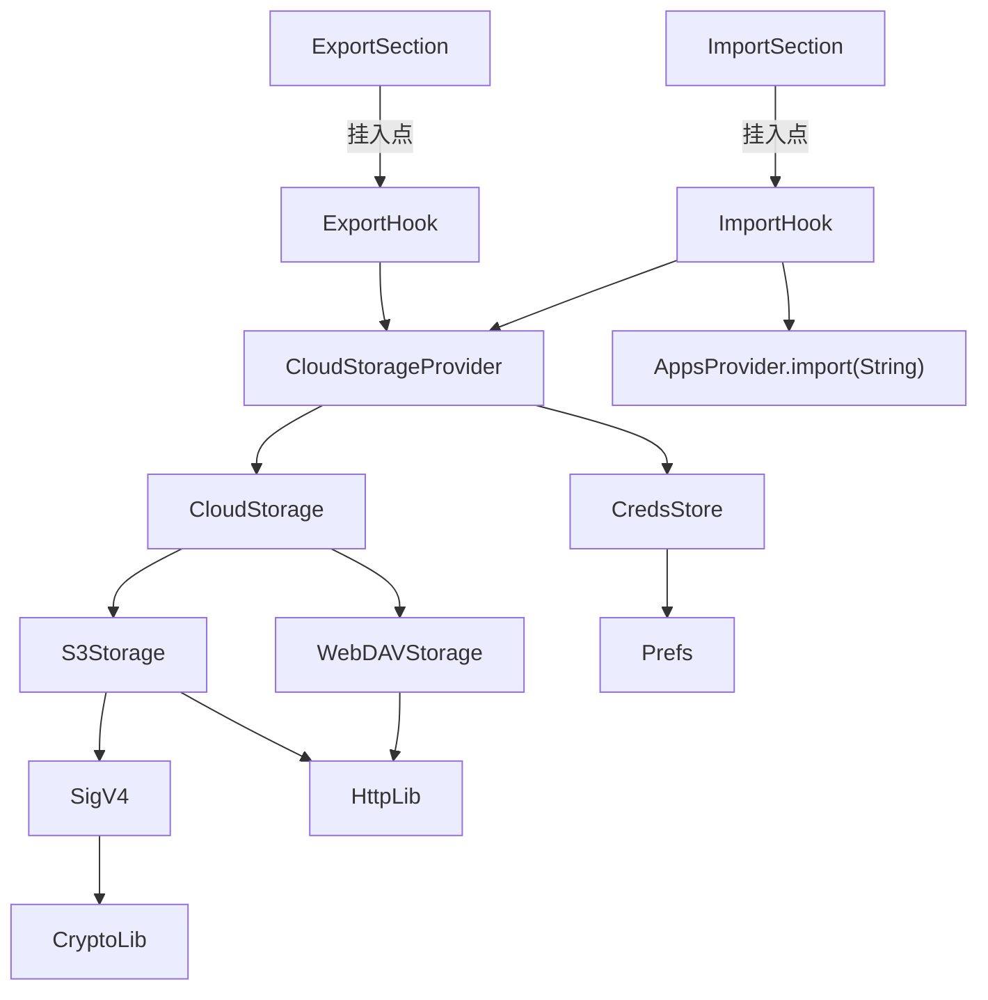
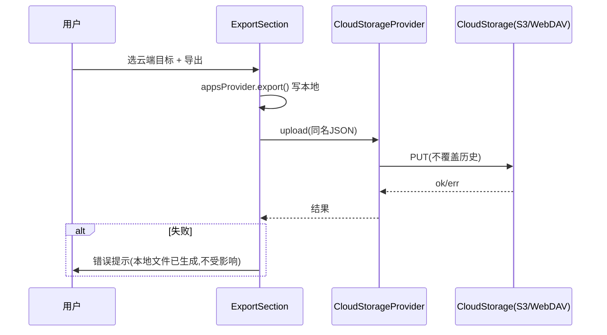
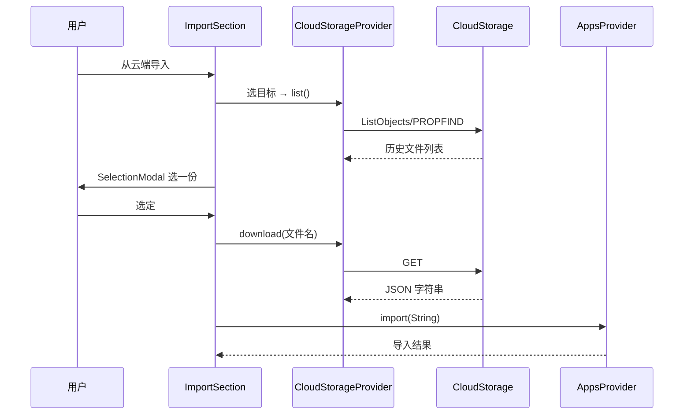

# Design Document

## Overview
**Purpose**: 本特性为 Obtainium 增加 S3/WebDAV 云端备份/恢复能力,使导出文件不依赖本机存储,换机/重装/丢手机后可恢复。
**Users**: Obtainium 长期个人 fork 维护者(可能 PR 上游)。
**Impact**: 在现有导出/导入流程末尾新增"推送到云端 / 从云端选"两步;新增凭证配置。核心传输逻辑隔离在新增文件,对既有导出/导入代码仅做极薄挂入。

### Goals
- 导出时可把同名 JSON 推送到选定的 S3/WebDAV 目标,云端保留历史(不覆盖)
- 导入时可列出云端历史文件、选一份下载恢复(复用现有导入逻辑)
- 「导出应用设置=全部」自动含 S3/WebDAV 凭证,导入自动恢复(零 schema 改动)
- 改动高度隔离:对既有文件仅极薄挂入点,核心实现全在新文件,便于 `git merge upstream`

### Non-Goals
- 自动定时后台备份(WorkManager 等)
- 凭证加密存储 / Keystore
- 云端历史文件清理策略
- 改变现有本地导出/导入行为或文件命名

## Boundary Commitments

### This Spec Owns
- S3 与 WebDAV 的上传 / 下载 / list 传输能力(含 Sig V4 拼装)
- 云端凭证的数据模型与持久化(沿用 prefs `-creds` 命名约定)
- 导出/导入流程的云端挂入点(选目标、推送、列历史、选一份)
- 凭证配置 UI

### Out of Boundary
- 本地导出/导入的既有逻辑与文件命名(只复用 `import(String)`、不改其行为)
- 设置持久化机制本身(SharedPreferences——只在其上新增 key)
- 后台调度、加密、清理(见 Non-Goals)

### Allowed Dependencies
- 项目现有依赖:`crypto`(HMAC-SHA256,Sig V4)、`http`(S3 与 WebDAV HTTP 传输)、`shared_preferences`、`easy_localization`、`provider`
- 现有 UI 组件:`GeneratedFormModal` / `GeneratedForm` / `SelectionModal` / `ConnectedCard` / `ActionListTile`
- **不引入任何新第三方依赖**

### Revalidation Triggers
- `AppsProvider.import(String)` 签名变化 → 云端导入喂入点需复核
- `exportSettings` 语义或 `-creds` 命名约定变化 → 凭证导出/导入覆盖需复核
- 现有导出文件名生成逻辑变化 → 云端"同名上传"假设需复核
- `ExportSection` / `ImportSection` 结构重构 → 挂入点需重新定位

## Architecture

### Existing Architecture Analysis
- 导出:`AppsProvider.generateExportJSON()` → `export()` 用 SAF 写文件,返回路径。
- 导入:`AppsProvider.import(String appsJSON)`:纯字符串入口,parse 后 `saveApps` + `_applyImportedSettings`。
- 设置:`SettingsProvider`(`ChangeNotifier`)+ SharedPreferences,secrets 以 `-creds` 后缀 key 标识。
- Provider 模式:全局 `MultiProvider`,新增 provider 注册即可被 UI `context.read/watch`。

### Architecture Pattern & Boundary Map



**Architecture Integration**:
- 选中模式:新增独立 `CloudStorageProvider`(与 `AppsProvider`/`SettingsProvider` 同层),UI 经薄挂入点调用它。
- 边界:云端传输与凭证完全隔离在新文件;既有导出/导入文件仅各插入一个极薄调用点。
- 既有模式保留:Provider + ChangeNotifier、`tr()` i18n、`GeneratedForm` 表单、`SelectionModal` 单选列表。
- 新组件理由:`CloudStorageProvider` 统一管理凭证与目标选择;`CloudStorage` 抽象让 S3/WebDAV 可互换、未来可扩展。

### Technology Stack

| Layer | Choice / Version | Role in Feature | Notes |
|-------|------------------|-----------------|-------|
| 传输(S3) | 手写 Sig V4 + `http ^1.6.0` | PutObject/GetObject/ListObjectsV2 | 零新依赖 |
| 传输(WebDAV) | `http ^1.6.0` | PROPFIND/PUT/GET | 纯 HTTP |
| 加密原语 | `crypto ^3.0.7` | HMAC-SHA256(Sig V4) | 已有依赖 |
| 持久化 | `shared_preferences ^2.5.5` | 凭证与设置 | 已有依赖 |
| 状态管理 | `provider ^6.1.5` | CloudStorageProvider | 已有依赖 |
| i18n | `easy_localization ^3.0.8` | UI 文案 | 已有依赖 |

## File Structure Plan

### Directory Structure
```
lib/
├── providers/
│   └── cloud_storage_provider.dart      # 凭证模型 + 目标选择 + 持久化(ChangeNotifier)
├── services/                             # 新目录:云端传输适配层(与业务解耦)
│   ├── cloud_storage.dart                # CloudStorage 抽象接口
│   ├── s3_storage.dart                   # S3 实现(含 Sig V4 拼装 + 自检)
│   └── webdav_storage.dart               # WebDAV 实现(PROPFIND/PUT/GET)
└── pages/
    └── import_export.dart                # 【改】加薄挂入点(见 Modified Files)
```
> 新增文件全部为 fork 专有,upstream 不含;既有文件改动仅集中在 import_export.dart 的两处挂入点。

### Modified Files
- `lib/pages/import_export.dart` — 两处极薄挂入:
  1. `ExportSection.runObtainiumExport` 成功后(现 L386-390 toast 处):若用户在导出前/后选择了云端目标,调用 `CloudStorageProvider.upload(文件名, jsonBytes)`。
  2. `ImportSection`(现 L309 `obtainiumImport` tile 附近):新增"从云端导入"`ActionListTile`,弹出目标选择 → `list` → `SelectionModal` 选一份 → `download` → 调既有 `appsProvider.import(String)`。
- `lib/main.dart` — 在 `MultiProvider` 中注册 `CloudStorageProvider`(若 provider 在此注册)。
- `assets/translations/*.json` — 新增 `cloudExport*` / `cloudImport*` 等 key。
- `pubspec.yaml` — **不改**(零新依赖)。

> 凭证存储不新建文件:沿用 prefs `-creds` 约定,由 `cloud_storage_provider.dart` 读写(见 Data Models)。

## System Flows





## Requirements Traceability

| Requirement | Summary | Components | Interfaces | Flows |
|-------------|---------|------------|------------|-------|
| 1.1-1.3 | S3/WebDAV 凭证配置并存 | CloudStorageProvider, CredsStore | CloudStorageProvider.creds | — |
| 1.4 | 无目标时禁用/提示 | ExportHook, ImportHook | — | — |
| 1.5 | 明文同机制存储 | CredsStore | prefs `-creds` | — |
| 2.1 | 选单目标推送 | ExportSection, CloudStorageProvider | upload | 导出流 |
| 2.2 | 同名上传 | CloudStorageProvider | upload | 导出流 |
| 2.3 | 不覆盖历史 | S3Storage, WebDAVStorage | upload | 导出流 |
| 2.4 | 失败保护本地 | ExportHook | — | 导出流 |
| 2.5 | 全部含凭证 | CredsStore(`-creds`约定) | — | — |
| 3.1 | 列历史文件 | ImportSection, CloudStorageProvider | list | 导入流 |
| 3.2 | 下载复用本地导入 | ImportHook, AppsProvider.import | download | 导入流 |
| 3.3 | 失败保护本机 | ImportHook | — | 导入流 |
| 3.4 | 经本地导入逻辑 | ImportHook → AppsProvider.import | — | 导入流 |
| 4.1 | 不改既有行为/命名 | (仅薄挂入点) | — | — |
| 4.2 | 与 upstream 解耦 | 新文件隔离 | — | — |
| 4.3 | 零新依赖 | services/* | — | — |

## Components and Interfaces

| Component | Domain/Layer | Intent | Req Coverage | Key Dependencies | Contracts |
|-----------|--------------|--------|--------------|------------------|-----------|
| CloudStorageProvider | Provider | 凭证模型、目标选择、持久化、编排上传/下载 | 1.x, 2.1, 3.1 | SettingsProvider(prefs), CloudStorage(P0) | Service |
| CloudStorage | Service 抽象 | 上传/下载/list 统一接口 | 2.2-2.3, 3.1-3.2 | — | Service |
| S3Storage | Service 传输 | S3 三操作 + Sig V4 | 2.2-2.3, 3.1-3.2 | crypto, http, SigV4(P0) | Service |
| WebDAVStorage | Service 传输 | WebDAV PROPFIND/PUT/GET | 2.2-2.3, 3.1-3.2 | http | Service |
| SigV4 | 纯函数工具 | AWS Sig V4 拼装 | 2.2, 3.2 | crypto | — |
| ExportHook / ImportHook | UI 挂入点 | 薄接入 | 2.1, 3.1 | CloudStorageProvider, AppsProvider.import(P0) | — |

### Service Layer

#### CloudStorageProvider

| Field | Detail |
|-------|--------|
| Intent | 管理凭证、目标选择,编排云端上传/下载/list |
| Requirements | 1.1, 1.2, 1.3, 1.5, 2.1, 3.1 |

**Responsibilities & Constraints**
- 持有当前已配置的 S3/WebDAV 凭证,持久化于 prefs(`-creds` key)
- 提供"列出可用目标""选一个目标"的编排
- 委托对应 `CloudStorage` 实现完成实际传输

**Contracts**: Service

##### Service Interface
```dart
class CloudStorageProvider with ChangeNotifier {
  // 凭证读写(沿用 prefs -creds 命名约定;多字段序列化为单字符串)
  S3Creds? get s3Creds;
  set s3Creds(S3Creds? v);
  WebDAVCreds? get webdavCreds;
  set webdavCreds(WebDAVCreds? v);

  // 可用目标(已配置凭证的 provider 列表)
  List<CloudTarget> get availableTargets;

  // 传输编排(每次由调用方传入选定目标,单目标)
  Future<void> upload(CloudTarget target, String filename, Uint8List bytes);
  Future<List<RemoteFile>> list(CloudTarget target);
  Future<String> download(CloudTarget target, String filename);
}
```
- Preconditions:目标对应凭证已配置
- Postconditions:upload 在云端产生新历史文件,不覆盖同名;download 返回可被 `import(String)` 消费的 JSON 字符串
- Invariants:UI 层每次操作只用一个 target

#### CloudStorage(抽象)

| Field | Detail |
|-------|--------|
| Intent | 统一 S3/WebDAV 传输接口 |
| Requirements | 2.2, 2.3, 3.1, 3.2 |

**Contracts**: Service

##### Service Interface
```dart
abstract class CloudStorage {
  Future<void> upload(String filename, Uint8List bytes);   // 历史保留,不覆盖
  Future<List<RemoteFile>> list();
  Future<String> download(String filename);               // 返回 JSON 字符串
}
```

#### S3Storage

| Field | Detail |
|-------|--------|
| Intent | S3(及兼容服务)的 PutObject/GetObject/ListObjectsV2 |
| Requirements | 2.2, 2.3, 3.1, 3.2 |

**Dependencies**: External `crypto`(Hmac/Sha256, P0)、`http`(P0)

**Contracts**: Service

##### Service Interface
- 构造:`S3Storage({required S3Creds creds}) implements CloudStorage`
- Sig V4:请求方法、URI、query、header canonical 化 → string to sign → 分层 HMAC-SHA256 → `Authorization` header
- region/endpoint/path-style 由 `S3Creds` 提供;默认兼容 AWS S3 与 MinIO/R2/B2

**Implementation Notes**
- 集成:纯 `http` 客户端,不引第三方
- 验证:基于 AWS 官方 Sig V4 测试向量的 `assert` 自检(纯函数,无网络,`flutter test` 可跑)
- 风险:兼容服务 region/path-style 差异 → 由凭证字段显式提供,非猜测

#### WebDAVStorage

| Field | Detail |
|-------|--------|
| Intent | WebDAV PROPFIND(列)/ PUT(传)/ GET(取),Basic Auth |
| Requirements | 2.2, 2.3, 3.1, 3.2 |

**Dependencies**: External `http`(P0)

**Contracts**: Service

**Implementation Notes**
- 集成:`PROPFIND` 解析 XML 取文件名+时间;`PUT` 上传;`GET` 下载
- 验证:对返回结构与认证失败分支的单元覆盖
- 风险:不同 WebDAV 服务(Nextcloud/坚果云/Synology)PROPFIND 响应差异 → 解析取通用字段

#### SigV4(纯函数)

| Field | Detail |
|-------|--------|
| Intent | AWS Signature V4 拼装(输入请求要素 + 凭证 → Authorization header) |
| Requirements | 2.2, 3.2 |

**Contracts**: 无副作用纯函数

##### Service Interface
```dart
String signSigV4({
  required String method,
  required Uri uri,
  required String region,
  required String service,        // "s3"
  required String accessKey,
  required String secretKey,
  required Uint8List body,        // 或空负载
  required String amzDate,
});
```
- Invariants:给定相同输入产出确定签名(可用官方测试向量验证)

### UI Layer

#### ExportHook / ImportHook
- 现状:见 File Structure Plan 的 Modified Files。
- 改动仅限薄接入:导出成功后按用户选定目标调 `upload`;导入入口新增"从云端导入"tile,串接 `list → SelectionModal → download → import(String)`。
- 复用既有 `SelectionModal`(单选)、`GeneratedFormModal`(凭证表单)。

## Data Models

### Domain Model
- `CloudTarget`:enum/discriminated union(`s3` / `webdav`),携带对应凭证引用
- `S3Creds`:endpoint、bucket、region、accessKey、secretKey、pathStyle(bool)
- `WebDAVCreds`:url、username、password
- `RemoteFile`:filename、lastModified(可按时间辨识/排序)

### Logical Data Model / 持久化
- `S3Creds` / `WebDAVCreds` 各自 `toJson()` 为字符串,存于 prefs key `s3-creds` / `webdav-creds`。
- **沿用现有 secrets 约定**:`-creds` 后缀 → `exportSettings=2(全部)` 时自动导出、导入自动回写(经现有 `_applyImportedSettings`,String 分支走 `setSettingString`)。
- `availableTargets`:由"非空凭证"派生,不单独持久化。

### Data Contracts & Integration
- 导出 JSON 不新增 schema 字段:凭证作为 prefs 值随现有 `settings` map 自动进出。
- 上传/下载文件名 = 现有本地导出文件名(`obtainium-<ISO时间戳>...json`),不在本特性发明命名。

## Error Handling

### Error Strategy
- 复用 `ObtainiumError` + `showError(e, context)` 既有模式向用户呈现错误。
- 上传失败:本地导出文件已生成,不受影响(Req 2.4)——上传在本地写盘之后、且其异常被独立捕获。
- 下载/恢复失败:不调用 `import`,本机状态不变(Req 3.3)。

### Error Categories and Responses
- 用户错误(配置不全/无目标):入口禁用或提示先配置(Req 1.4)
- 认证失败(403/401):`showError` 显示,凭证问题导向配置
- 网络失败/超时:`showError` 显示,可重试(用户手动)

## Testing Strategy
- **Unit**:
  - SigV4:AWS 官方测试向量 → 已知输入产出已知签名(`assert`,无网络)
  - `S3Creds`/`WebDAVCreds` 序列化往返
  - 文件名排序/辨识(按时间)
- **Unit(传输,离线)**:用内存/fake `CloudStorage` 验证 `CloudStorageProvider` 编排:upload 不覆盖历史、list/download 行为、无目标时 `availableTargets` 为空
- **E2E 路径**(关键用户流,依赖真实服务,可选/手动):
  - 导出 → 云端出现同名新历史文件
  - 从云端列历史 → 选一份 → 恢复成功

> 按项目测试约定(优先单元测试、零外部依赖),传输层单测用 fake 注入;真实 S3/WebDAV 验证留作手动。

## Security Considerations
- 明文凭证:与现有 token/source 凭证同机制,用户已确认接受(个人 fork)
- 导出"全部"含明文凭证:用户已确认;不引入 Keystore(避免新依赖与 fork 复杂度)
- Sig V4 仅在内存拼装 Authorization,不日志化 secret

## Supporting References
- 背景勘察见 `research.md`(集成点行号、Sig V4 可行性、架构方案对比)
